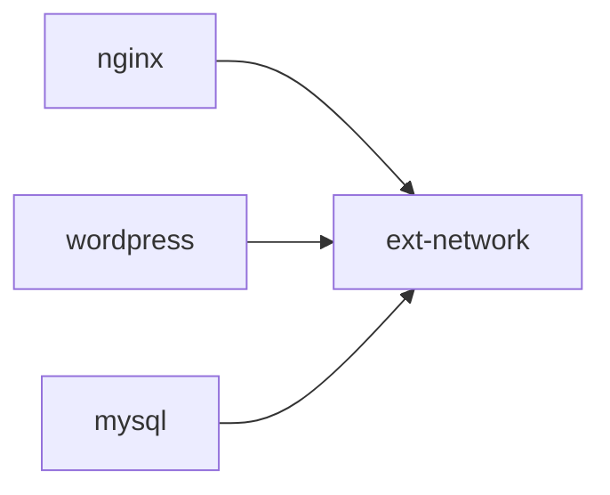

# Docker network
```
docker network create ext-network
```
# Install Ping
```
apt-get update -y
apt-get install -y iputils-ping
```

# diagram


```mermaid
graph LR
    nginx["nginx"] --> net["ext-network"]
    wp["wordpress"] --> net["ext-network"]
    db["mysql"] --> net["ext-network"]
```
